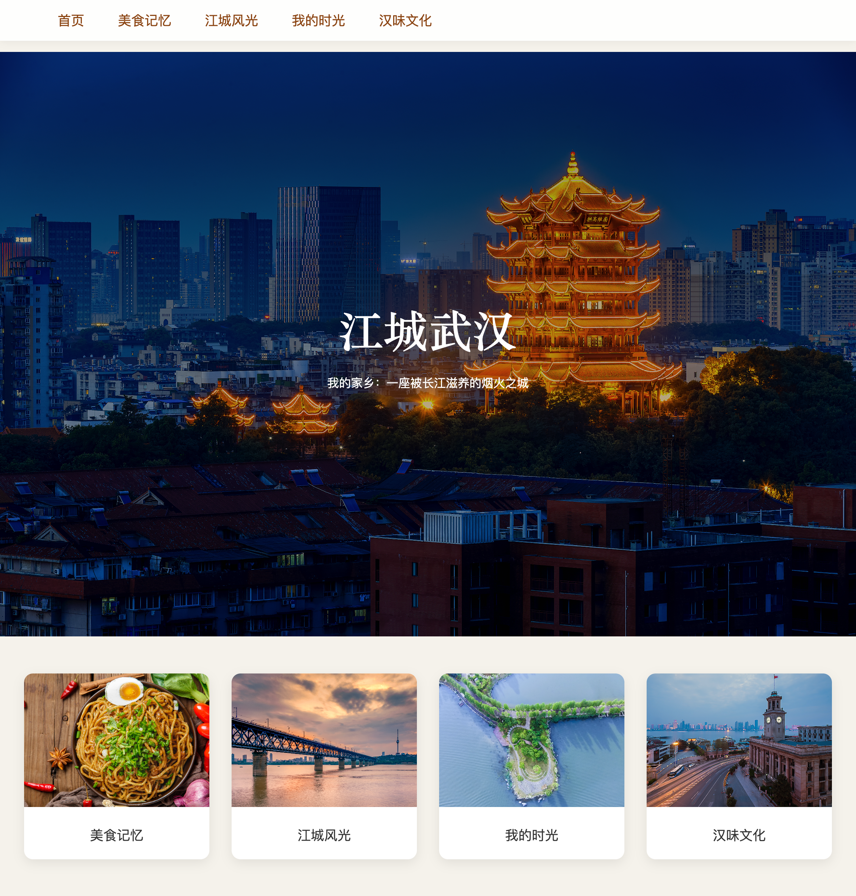

<div align="center">

# MyWeb-Wuhan

**江城武汉——我的烟火故乡**

🎓 华中科技大学 **《新生实践课》** 课程期末项目

**课程成绩：95/100**

🌐 **语言**

**[English](README.md) | 简体中文**

🌍 **在线体验**

https://jimmyzheng6.github.io/MyWeb-Wuhan/

</div>

---

## 📸 项目预览

<p align="center">
  
</p>

---

## 📖 项目简介

**MyWeb-Wuhan（江城武汉）** 是一个以武汉城市文化为主题的静态网页项目。

本项目采用 **HTML5** 与 **CSS3** 开发，作为华中科技大学 **《Computer Skills Practice for Freshman》** 课程的期末网页设计项目完成，最终课程成绩 **95/100**。

网站从四个主题展示我的家乡武汉：

- 🍜 美食记忆
- 🌉 江城风光
- 📖 我的时光
- 🏮 汉味文化

---

## ✨ 项目特色

- 多页面静态网站
- 响应式布局
- 固定导航栏
- 首页卡片式导航
- CSS 悬停动画
- 简洁统一的页面设计

---

## 📂 项目结构

```text
MyWeb-Wuhan
│
├── index.html
├── image/
└── web/
    ├── food.html
    ├── scenery.html
    ├── memory.html
    └── culture.html
```

---

## 🛠 技术栈

- HTML5
- CSS3
- Flexbox
- CSS Grid

---

## 🚀 运行方式

下载或克隆项目后，直接使用浏览器打开 **index.html** 即可运行，无需安装任何第三方依赖。

---

## 📋 项目信息

| 项目 | 内容 |
|------|------|
| 学校 | 华中科技大学 |
| 课程 | 新生实践课 |
| 项目 | 期末网页设计项目 |
| 技术 | HTML5 + CSS3 |
| 成绩 | **95/100** |

---


## 👨‍💻 作者

**JimmyZheng6**

华中科技大学

---

> **江城武汉——一座被长江滋养、充满烟火气与人情味的城市。**
